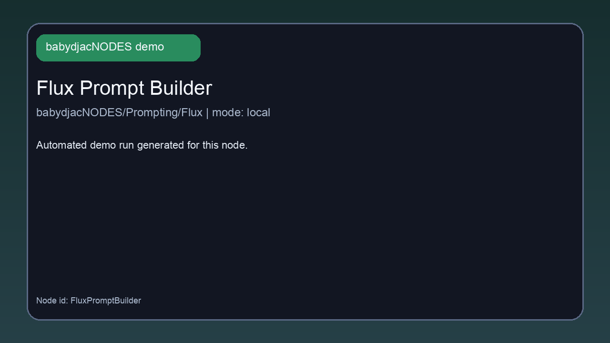
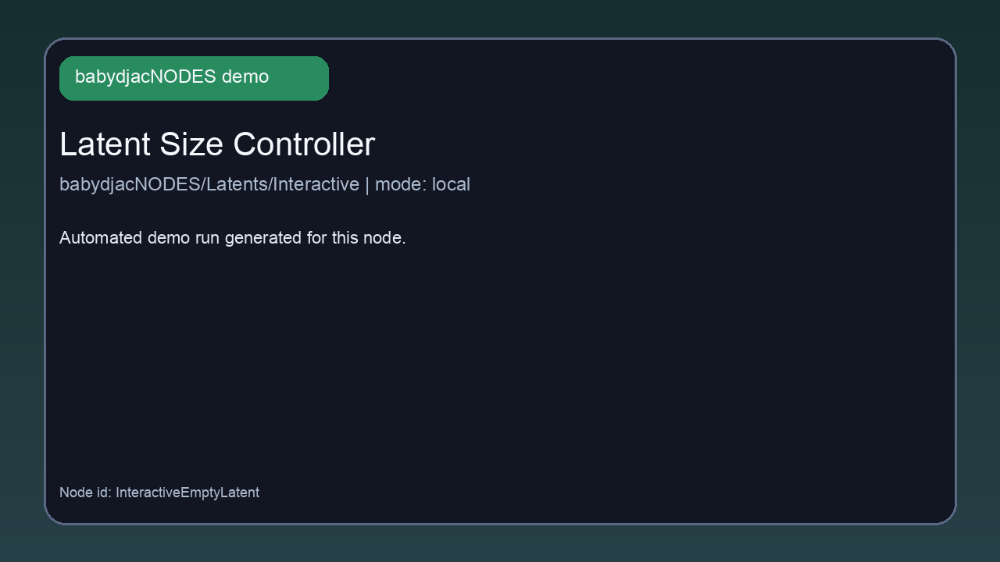
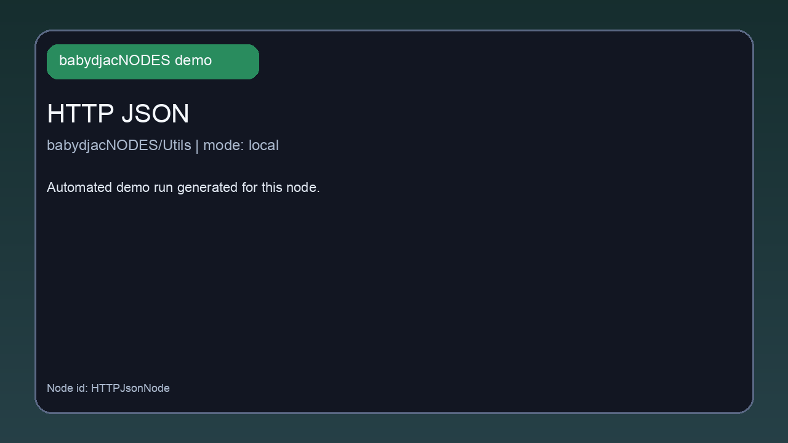

# babydjacNODES

Custom ComfyUI nodes for prompting, analysis, latent setup, LoRA loading, taglist tools, and utility workflows.

## Demo Gallery

Automated demo assets for every registered node are generated into `assets/demos/`.

- Demo format: `.gif` for README preview, `.mp4` companion file for the same node.
- Verification source: generated from live node execution plus the status manifest at `assets/demos/manifest.json`.
- Current provider caveats:
  - `FluxLambdaPrompter` is blocked until `LAMBDA_API_KEY` is provided.
  - `GrokPonyXLPrompter` currently returns an xAI `400` for the sample request used in demo generation.
  - `WAN22PromptStudioNode`, `ZImagePromptEngineer`, and `ZImageTurboPromptEngineer` currently surface provider/model errors for the configured xAI model path in this environment.

### Quick Preview

#### Flux Prompt Builder

#### Latent Size Controller

#### HTTP JSON

#### Safe Tag List Prompt

### All Node Demos

| Node | Demo |
| --- | --- |
| Grok Image Describer | [GIF](assets/demos/NSFWGrokDescriber.gif) · [MP4](assets/demos/NSFWGrokDescriber.mp4) |
| Grok Image Describer Pro | [GIF](assets/demos/NSFWGrokDescriberPro.gif) · [MP4](assets/demos/NSFWGrokDescriberPro.mp4) |
| Grok Flux Prompt Optimizer | [GIF](assets/demos/GrokFluxPromptOptimizer.gif) · [MP4](assets/demos/GrokFluxPromptOptimizer.mp4) |
| Latent Size Controller | [GIF](assets/demos/InteractiveEmptyLatent.gif) · [MP4](assets/demos/InteractiveEmptyLatent.mp4) |
| LoraFcKingLoader | [GIF](assets/demos/LoraFcKingLoader.gif) · [MP4](assets/demos/LoraFcKingLoader.mp4) |
| Qwen Image Prompter | [GIF](assets/demos/QwenImagePrompter.gif) · [MP4](assets/demos/QwenImagePrompter.mp4) |
| Flux Dual Prompt Node (Grok) | [GIF](assets/demos/FluxDualPromptNode.gif) · [MP4](assets/demos/FluxDualPromptNode.mp4) |
| Flux Lambda Prompter | [GIF](assets/demos/FluxLambdaPrompter.gif) · [MP4](assets/demos/FluxLambdaPrompter.mp4) |
| Flux Lifestyle Prompt Node | [GIF](assets/demos/FluxLifestylePromptNode.gif) · [MP4](assets/demos/FluxLifestylePromptNode.mp4) |
| Flux Prompt Builder | [GIF](assets/demos/FluxPromptBuilder.gif) · [MP4](assets/demos/FluxPromptBuilder.mp4) |
| Grok PonyXL Prompter | [GIF](assets/demos/GrokPonyXLPrompter.gif) · [MP4](assets/demos/GrokPonyXLPrompter.mp4) |
| Grok to PonyXL Prompt | [GIF](assets/demos/NSFWGrokToPonyXL.gif) · [MP4](assets/demos/NSFWGrokToPonyXL.mp4) |
| WAN 2.2 Prompt Studio | [GIF](assets/demos/WAN22PromptStudioNode.gif) · [MP4](assets/demos/WAN22PromptStudioNode.mp4) |
| Z-Image Prompt Engineer | [GIF](assets/demos/ZImagePromptEngineer.gif) · [MP4](assets/demos/ZImagePromptEngineer.mp4) |
| Z-Image Turbo Prompt Engineer | [GIF](assets/demos/ZImageTurboPromptEngineer.gif) · [MP4](assets/demos/ZImageTurboPromptEngineer.mp4) |
| Safe Tag List Prompt | [GIF](assets/demos/SafeTagListPromptNode.gif) · [MP4](assets/demos/SafeTagListPromptNode.mp4) |
| Taglist Prompt | [GIF](assets/demos/TagListPromptNode.gif) · [MP4](assets/demos/TagListPromptNode.mp4) |
| Template Driven Taglist | [GIF](assets/demos/TemplateDrivenTagListPromptNode.gif) · [MP4](assets/demos/TemplateDrivenTagListPromptNode.mp4) |
| Grok Prompt Fusion Pro | [GIF](assets/demos/NSFWGrokFusionPro.gif) · [MP4](assets/demos/NSFWGrokFusionPro.mp4) |
| HTTP JSON | [GIF](assets/demos/HTTPJsonNode.gif) · [MP4](assets/demos/HTTPJsonNode.mp4) |
| No-Repeat Picker | [GIF](assets/demos/NoRepeatPickerNode.gif) · [MP4](assets/demos/NoRepeatPickerNode.mp4) |
| Prompt Merge | [GIF](assets/demos/PromptMergeNode.gif) · [MP4](assets/demos/PromptMergeNode.mp4) |
| Taglist Sanitizer | [GIF](assets/demos/TaglistSanitizerNode.gif) · [MP4](assets/demos/TaglistSanitizerNode.mp4) |
| Text Cache | [GIF](assets/demos/TextCacheNode.gif) · [MP4](assets/demos/TextCacheNode.mp4) |
| Weight Adjust | [GIF](assets/demos/WeightAdjustNode.gif) · [MP4](assets/demos/WeightAdjustNode.mp4) |
| Prompt Rotator (Dynamic Batch) | [GIF](assets/demos/DynamicPromptBatcher.gif) · [MP4](assets/demos/DynamicPromptBatcher.mp4) |

## Install

1. Clone this repository into `ComfyUI/custom_nodes/` as `babydjacNODES`.
2. Restart ComfyUI after Python changes.
3. Hard-refresh the browser after JavaScript changes.

## Node Index

Total nodes: **26**

### `babydjacNODES/Analyze`

- **Grok Image Describer** (`NSFWGrokDescriber`): Vision call that returns a single raw NSFW-oriented description string (lighter than Pro; supports `XAI_API_KEY` / `GROK_API_KEY` when the widget is empty).
- **Grok Image Describer Pro** (`NSFWGrokDescriberPro`): Returns expanded descriptive prompt outputs from an image and instruction set. ([docs](docs/nodes/NSFWGrokDescriberPro.md))
- **Grok Flux Prompt Optimizer** (`GrokFluxPromptOptimizer`): Optimizes an existing Flux prompt from image context and user edit instructions. ([docs](docs/nodes/GrokFluxPromptOptimizer.md))

### `babydjacNODES/Latents/Interactive`

- **Latent Size Controller** (`InteractiveEmptyLatent`): Creates an empty latent with interactive resolution controls (graph/histogram UI + model-aware presets). ([docs](docs/nodes/InteractiveEmptyLatent.md))

### `babydjacNODES/Loaders`

- **LoraFcKingLoader** (`LoraFcKingLoader`): Loads and stacks multiple LoRA files on top of a base model and CLIP, in slot order. ([docs](docs/nodes/LoraFcKingLoader.md))

### `babydjacNODES/Prompting`

- **Qwen Image Prompter** (`QwenImagePrompter`): Generates image prompts using a Qwen-style prompt strategy and formatting. ([docs](docs/nodes/QwenImagePrompter.md))

### `babydjacNODES/Prompting/Flux`

- **Flux Dual Prompt Node (Grok)** (`FluxDualPromptNode`): Calls Grok to produce dual Flux prompts (short CLIP-style + long descriptive prompt). ([docs](docs/nodes/FluxDualPromptNode.md))
- **Flux Lambda Prompter** (`FluxLambdaPrompter`): Uses a Lambda-hosted model endpoint to generate refined Flux prompt pairs. ([docs](docs/nodes/FluxLambdaPrompter.md))
- **Flux Lifestyle Prompt Node** (`FluxLifestylePromptNode`): Enhances lifestyle photo prompts through Grok for Flux-focused generation. ([docs](docs/nodes/FluxLifestylePromptNode.md))
- **Flux Prompt Builder** (`FluxPromptBuilder`): Constructs Flux-ready positive and negative prompts using local templates and safety controls. ([docs](docs/nodes/FluxPromptBuilder.md))

### `babydjacNODES/Prompting/PonyXL`

- **Grok PonyXL Prompter** (`GrokPonyXLPrompter`): Analyzes an input image with Grok Vision and returns PonyXL-style prompt/negative tags. ([docs](docs/nodes/GrokPonyXLPrompter.md))
- **Grok to PonyXL Prompt** (`NSFWGrokToPonyXL`): Transforms freeform prompt text into PonyXL-friendly positive/negative/tag outputs. ([docs](docs/nodes/NSFWGrokToPonyXL.md))

### `babydjacNODES/Prompting/WAN-2.2`

- **WAN 2.2 Prompt Studio** (`WAN22PromptStudioNode`): Generates WAN 2.2 oriented prompt sets for video/image workflows. ([docs](docs/nodes/WAN22PromptStudioNode.md))

### `babydjacNODES/Prompting/Z-Image`

- **Z-Image Prompt Engineer** (`ZImagePromptEngineer`): Builds a structured Z-Image prompt with positive/negative text and generation settings. ([docs](docs/nodes/ZImagePromptEngineer.md))
- **Z-Image Turbo Prompt Engineer** (`ZImageTurboPromptEngineer`): Fast prompt builder for Z-Image Turbo workflows with simplified controls. ([docs](docs/nodes/ZImageTurboPromptEngineer.md))

### `babydjacNODES/Taglists`

- **Safe Tag List Prompt** (`SafeTagListPromptNode`): Converts tag lists into cleaner prompt text with safety-oriented defaults. ([docs](docs/nodes/SafeTagListPromptNode.md))
- **Taglist Prompt** (`TagListPromptNode`): Direct tag list prompt node that inherits the SafeTagListPromptNode behavior. ([docs](docs/nodes/TagListPromptNode.md))
- **Template Driven Taglist** (`TemplateDrivenTagListPromptNode`): Builds prompt text from tag lists with a configurable template layer. ([docs](docs/nodes/TemplateDrivenTagListPromptNode.md))

### `babydjacNODES/Utils`

- **Grok Prompt Fusion Pro** (`NSFWGrokFusionPro`): Combines and weights multiple prompt fragments with style presets and annotation output. ([docs](docs/nodes/NSFWGrokFusionPro.md))
- **HTTP JSON** (`HTTPJsonNode`): Makes HTTP requests and returns response text for API-backed workflows. ([docs](docs/nodes/HTTPJsonNode.md))
- **No-Repeat Picker** (`NoRepeatPickerNode`): Selects items from a multiline list while persisting no-repeat history. ([docs](docs/nodes/NoRepeatPickerNode.md))
- **Prompt Merge** (`PromptMergeNode`): Merges multiple tag lists with optional dedupe, case normalization, sorting, and truncation. ([docs](docs/nodes/PromptMergeNode.md))
- **Taglist Sanitizer** (`TaglistSanitizerNode`): Sanitizes tag lists (dedupe, lowercase, strip weights, sort). ([docs](docs/nodes/TaglistSanitizerNode.md))
- **Text Cache** (`TextCacheNode`): Small key/value text cache node with get/set/delete operations. ([docs](docs/nodes/TextCacheNode.md))
- **Weight Adjust** (`WeightAdjustNode`): Applies weight scaling rules across weighted and unweighted prompt tags. ([docs](docs/nodes/WeightAdjustNode.md))

### `babydjacNODES/Utils/Batching`

- **Prompt Rotator (Dynamic Batch)** (`DynamicPromptBatcher`): Collects prompt inputs into a list output for batched or rotating workflows. ([docs](docs/nodes/DynamicPromptBatcher.md))

## Notes

- Node colors are assigned by top-level category in the frontend extension.
- Grok-capable nodes accept `XAI_API_KEY` or `GROK_API_KEY` when the widget `api_key` field is left empty (where implemented).
- **HTTP JSON** only allows `http`/`https` URLs that include a host (other schemes are rejected).
- Several nodes call external APIs (xAI/Lambda/HTTP). Review your API keys and usage policies before production use.
- For node-by-node details, use the linked docs in `docs/nodes/.`
